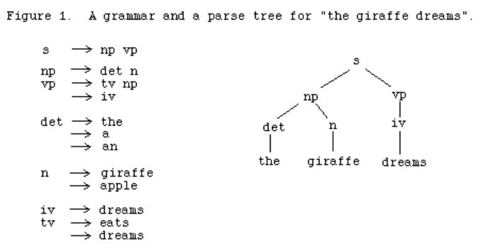
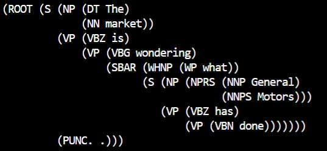

# CYKParser
Implementation of a Probabilistic CYK Parser 
Developed in context of NYU Graduate Natural Language Processing Course

We wish to parse sentences given specific grammar rules and their production
probabilities over a corpus 

* The figure below indicates grammar rules that give rise to a parse tree for the
specified sentence [1]. 

* Using the added probabilities of production rules and bottom up dynamic programming, 
more specifically the CYK Parsing Algorithm we can generate the most likely parse tree.

* The parsing algorithm is tested on a subset of the WSJ treebank dataset. Over 10,000
grammar production rules are utilized to produce parse trees for new sentences. An example
for "The Market is wondering waht General Motors has done." is shown below.

**CODE** 

cykparser.py   : implementation of classes for grammar rules and Probabalistic Context Free Grammers (PCFG)
eval.py        : calls cykparser methods and generates most likely parse tree for given datasets
data           : contains grammar rules with probabilities for an arithmetic dataset and a wall street dataset

[1]: Allen, James, Natural Language Understanding 2e, Benjamin Cummings, 1995.
